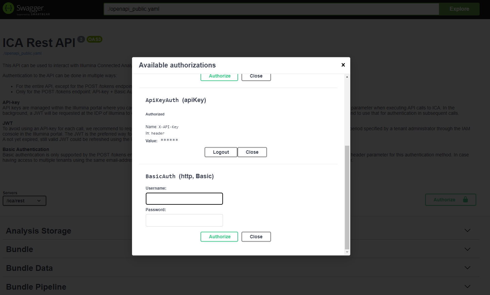
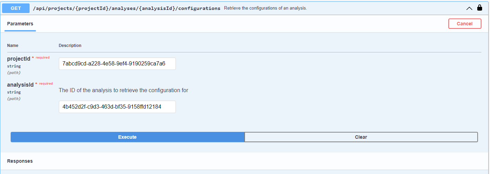

# How to compose an ICAv2 CLI to submit DRAGEN analysis in batch

## Step 1: Settle down DRAGEN desired parameter set
1. Browse available options in out-of-box DRAGEN pipelines, `Start New Analysis` page.
2. For some of out-of-box DRAGEN pipelines, addition parameters and flags can be passed in via the `Additional DRAGEN args` slot,
following `--flag setting` format, please refer to [DRAGEN online User Guide](https://support-docs.illumina.com/SW/DRAGEN_v40/Content/SW/FrontPages/DRAGEN.htm) for available options.

## Step 2: Submit a test analysis in GUI and get the "analysis id"
After settled down with the parameter setting, submit a test run in GUI with all the desired parameters. 
Retrieve the "analysis id" from UI or use `icav2` CLI. The first column "ID" is the analysis id.
```bash
icav2 projectanalyses list
ID                                      REFERENCE                                                                                                                               CODE                                    STATUS 
4b452d2f-c9d3-463d-bf35-9158ffd12184    DRAGEN_Germline_Whole_Genome_3-10-4_PRJ210452_L2100610-DRAGEN Germline Whole Genome 3-10-4-v2-b59b1bd8-2134-4de6-b250-ac7b494caf83      DRAGEN Germline Whole Genome 3-10-4-v2  SUCCEEDED
505b371c-518b-4269-9fd2-2e359a58f77c    PRJ210452_L2100610-DRAGEN Germline Whole Genome 3-10-4-v2-f3b6a085-d7dc-42a5-a399-16ad3e11286a                                          DRAGEN Germline Whole Genome 3-10-4-v2  SUCCEEDED
d9aa0850-5b58-4bb7-a182-710916b15b5f    PRJ210452_L2100610-DRAGEN Germline Whole Genome 3-10-4-v2-2e92fda1-8a8f-4fe3-a47a-d449f17c6a65                                          DRAGEN Germline Whole Genome 3-10-4-v2  ABORTED
a5ba4bb0-3540-4ecb-a236-eaea44eec91f    PRJ210452_L2100610-DRAGEN Germline Whole Genome 3-10-4-v2-7c02f8a2-14e9-4b70-b0a2-0c6e516e137e                                          DRAGEN Germline Whole Genome 3-10-4-v2  SUCCEEDED
No of items :  4
```
## Step 2: Get input codes via icav2 CLI
Using the `analysis id` get from step 2, which is `4b452d2f-c9d3-463d-bf35-9158ffd12184` in this example , the codes available input files/folders
can be listed.
```base
icav2 projectanalyses input 4b452d2f-c9d3-463d-bf35-9158ffd12184
CODE                            NAMES                                                                                                                                                                                         DATA ID
bais                                                                                                                                                                                                                           
bams                                                                                                                                                                                                                           
fastq_list                      PRJ210452_L2100610_fastq_list.csv                                                                                                                                                             fil.21c7019bda1440eaa00d08da2ee71506
fastqs                          PRJ210452_L2100610_topup_S14_L004_R2_001.fastq.gz,PRJ210452_L2100610_topup_S14_L004_R1_001.fastq.gz,PRJ210452_L2100610_S4_L001_R2_001.fastq.gz,PRJ210452_L2100610_S4_L001_R1_001.fastq.gz     fil.d80074ea8ca94a13a80408da2ee71506,fil.372fbeb0f62e4bca3ae908da298b9947,fil.80f74149b07f4a87a7f308da2ee71506,fil.c214d5ab64674305a7ee08da2ee71506
hla_allele_frequency_file                                                                                                                                                                                                      
hla_bed_file                                                                                                                                                                                                                   
hla_reference_file                                                                                                                                                                                                             
qc_coverage_region_beds                                                                                                                                                                                                        
ref_tar                         hg38_altaware_graph_based.v8.tar                                                                                                                                                              fil.48a0f63157c54624ea2908d9ba754d71
sv_call_regions_bed                                                                                                                                                                                                            
vc_ml_zip                                                                                                                                                                                                                      
No of items :  11
```
The first column are the codes to put as the keys of `--input` type parameters. 
## Step 3: Get parameter codes via ICAv2 Swagger page
To get the codes of parameter type input of a DRAGEN pipeline, you can use this [ICAv2 Swagger endpoint](https://ica.illumina.com/ica/api/swagger/index.html#/Project%20Analysis/getAnalysisConfigurations).

Firstly, you need to put in the ICAv2 API-key of your account to give it access. 
Then you can query the endpoint by providing the "project id" and "analysis id".

You can also use `curl` to query the url in the form of `https://ica.illumina.com/ica/rest/api/projects/{project_id}/analyses/{analysis_id}/configuration`.
```bash
curl -X 'GET' \
  'https://ica.illumina.com/ica/rest/api/projects/7abcd9cd-a228-4e58-9ef4-9190259ca7a6/analyses/4b452d2f-c9d3-463d-bf35-9158ffd12184/configurations' \
  -H 'accept: application/vnd.illumina.v3+json' \
  -H 'X-API-Key: xxxxxxxxxxxxxxxxxxx'
```
Both of these methods will return the list of parameters used in the test analysis in JSON format. The values of "name" objects are the codes.
<details>
<summary>
Click to view the parameter list json 
</summary>
```json
{
  "items": [
    {
      "name": "enable_dragen_reports",
      "multiValue": false,
      "values": []
    },
    {
      "name": "additional_args",
      "multiValue": false,
      "values": []
    },
    {
      "name": "enable_map_align",
      "multiValue": false,
      "values": []
    },
    {
      "name": "enable_map_align_output",
      "multiValue": false,
      "values": []
    },
    {
      "name": "output_format",
      "multiValue": false,
      "values": []
    },
    {
      "name": "enable_duplicate_marking",
      "multiValue": false,
      "values": []
    },
    {
      "name": "enable_variant_caller",
      "multiValue": false,
      "values": [
        "true"
      ]
    },
    {
      "name": "vc_emit_ref_confidence",
      "multiValue": false,
      "values": []
    },
    {
      "name": "vc_enable_vcf_output",
      "multiValue": false,
      "values": []
    },
    {
      "name": "enable_cnv",
      "multiValue": false,
      "values": []
    },
    {
      "name": "sample_sex",
      "multiValue": false,
      "values": []
    },
    {
      "name": "cnv_segmentation_mode",
      "multiValue": false,
      "values": []
    },
    {
      "name": "qc_coverage_report",
      "multiValue": true,
      "values": [
        ""
      ]
    },
    {
      "name": "qc_coverage_filters",
      "multiValue": true,
      "values": [
        ""
      ]
    },
    {
      "name": "enable_sv",
      "multiValue": false,
      "values": []
    },
    {
      "name": "repeat_genotype_enable",
      "multiValue": false,
      "values": []
    },
    {
      "name": "enable_smn",
      "multiValue": false,
      "values": []
    },
    {
      "name": "enable_cyp2d6",
      "multiValue": false,
      "values": []
    },
    {
      "name": "enable_gba",
      "multiValue": false,
      "values": []
    },
    {
      "name": "enable_hla",
      "multiValue": false,
      "values": []
    },
    {
      "name": "hla_tiebreaker_threshold",
      "multiValue": false,
      "values": []
    },
    {
      "name": "hla_zygosity_threshold",
      "multiValue": false,
      "values": []
    }
  ]
}
```
</details>
## Step 4: Compose the analysis submitting CLI
With the input codes and parameter codes that you could put as keys in the CLI after `--input` and `--paramter` flags,
you can compose your own analysis launching CLI. For example:
```bash
icav2 projectpipelines start nextflow 61f71142-10b7-472e-af54-26c589fbfcd6 \
  --user-reference "PRJ210452_L2100610_DRAGEN Germline Whole Genome 3-10-4-v2" \
  --input "fastqs":"fil.d80074ea8ca94a13a80408da2ee71506","fil.372fbeb0f62e4bca3ae908da298b9947","fil.80f74149b07f4a87a7f308da2ee71506","fil.c214d5ab64674305a7ee08da2ee71506"   --input "ref_tar":"fil.48a0f63157c54624ea2908d9ba754d71" \
  --input "fastq_list":"fil.21c7019bda1440eaa00d08da2ee71506" \
  --parameters "enable_dragen_reports":"true" \
  --parameters "additional_args":"--repeat-genotype-specs /opt/edico/repeat-specs/experimental/smn-catalog.hg38.json" \
  --parameters "enable_map_align":"true" \
  --parameters "enable_map_align_output":"true" \
  --parameters "output_format":"BAM" \
  --parameters "enable_variant_caller":"true" \
  --parameters "vc_emit_ref_confidence":"GVCF" \
  --parameters "enable_cnv":"true" \
  --parameters "cnv_segmentation_mode":"SLM" \
  --parameters "enable_sv":"true" \
  --parameters "repeat_genotype_enable":"true" \
  --parameters "enable_smn":"true" \
  --parameters "enable_hla":"true" \
  --parameters "enable_cyp2d6":"true" \
  --output-parent-folder fol.27269c2d760e43fe2e6208da298b9947 \
  --storage-size SMALL \
  -o json
```
## Example: use `for` loop to launch analyses in batch
Please go to the [example](example) folder for examples of the CLI, return message and logs for launching analysis in batch.